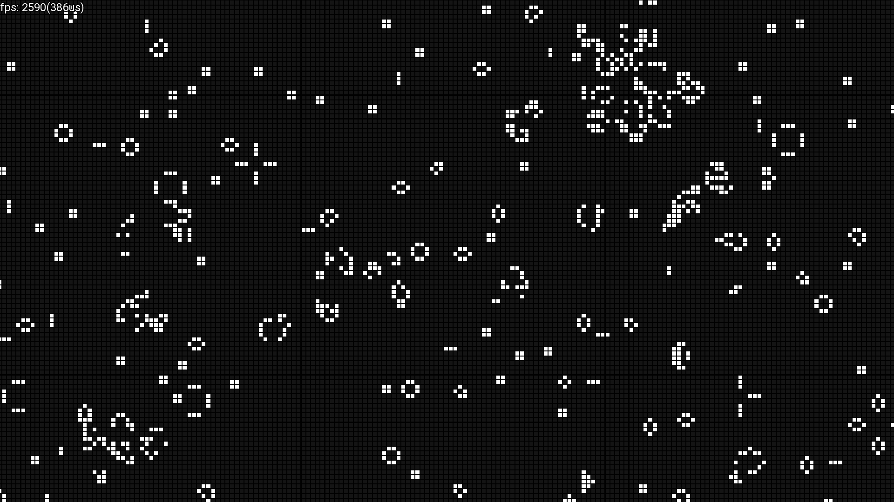
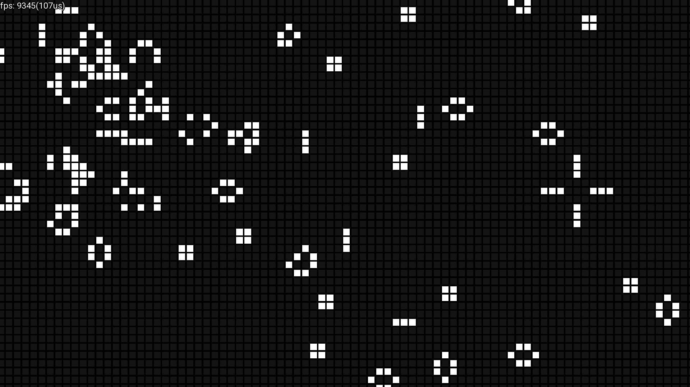

# game_of_life
Conway's game of life written in C++ using SFML library.  

# Screenshots (OLD)



# Features
* Zooming (scroll with your mouse)
* Moving around (move the mouse while pressing the mouse scroll)
* Pausing (hit escape or click the GUI pause button)
* Placing cells (hold/click left mouse button)
* Removing cells (hold/click right mouse button)

# To do
* Chunk system
* Infinite world
* Game settings (GUI)

# Optimizations
Used optimizations:
* Cell culling (render only visible cells) (chunk culling should replace this in future)
* Vertex array (sending data to the GPU in single draw call)
* Logic is calculated on separate thread
* VertexArray building is on separate thread
* VertexArray is rebuilt only when necessary  

SFML is sort of limiting in sense of optimizing the rendering, but I think sending a single vertex per cell and a geometry shader would help a lot with render time.

# Running
## If you're on Linux
* Make sure you have SFML2 and TGUI installed on your system.  
* Run these commands:  
	* ```git clone https://github.com/rxttthin/game_of_life```   
	* ```cd game_of_life```   
	* ```./run.sh```  

## If you're on Windows
There's no build support for windows, but in the future you should be able to download Windows binaries
